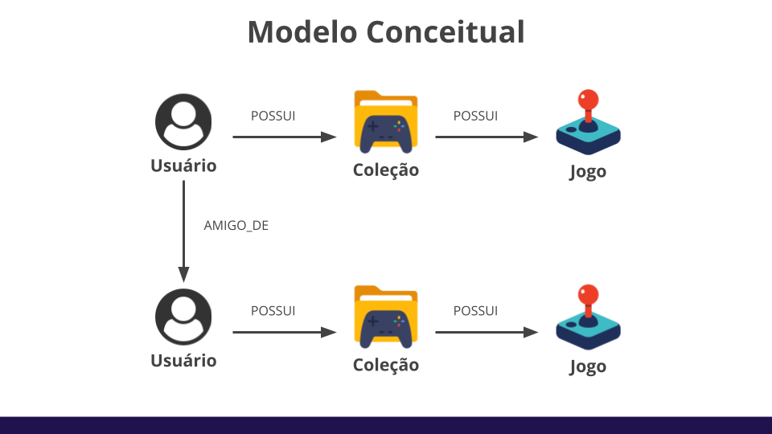
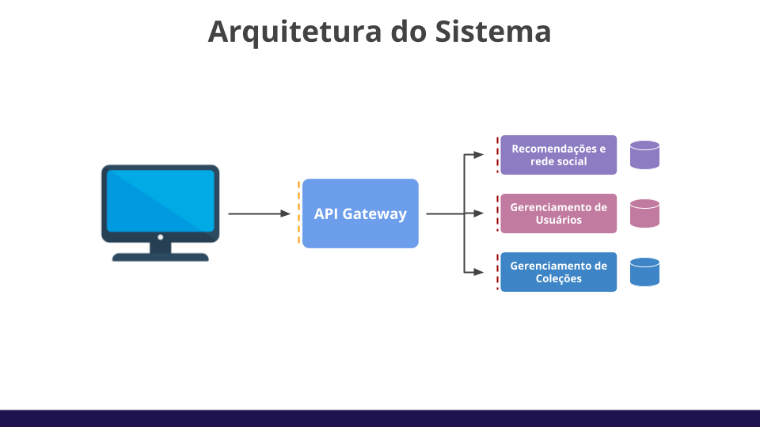
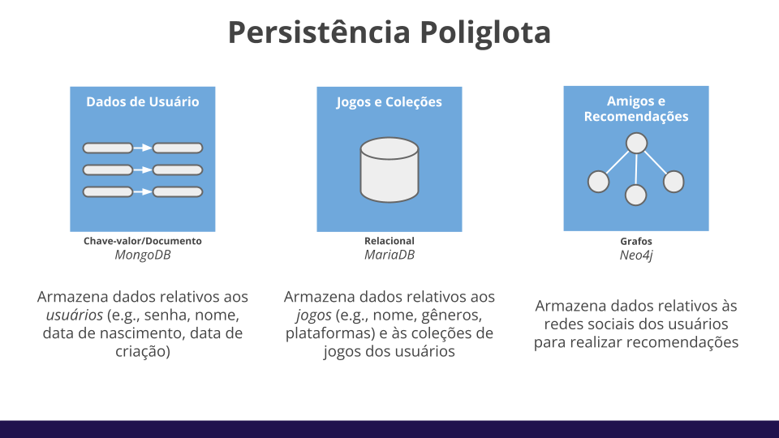

# Biblioteca de Jogos Digitais

Esse repositório contém as fontes de dados para um sistema de biblioteca de jogos digitais que usa *Persistência Poliglota*. Os SGBDs escolhidos foram: *MongoDB* (Chave-valor/Documento); *MariaDB* (Relacional); *Neo4j* (Grafos).

## Descrição do Mini-mundo

> O sistema proposto é uma rede social focada em jogos digitais oferecidos por diferentes plataformas (Steam, Epic, etc). Todo **usuário** da plataforma possui um **perfil**. 
> 
> Um **perfil** é composto por um conjunto de informações pessoais e diferentes jogos organizados em **coleções**. Todo usuário pode adicionar outros usuários como *amigos*. 
> 
> É possível encontrar *recomendações de jogos* para cada uma das coleções que o usuário possui.
> 
> O principal objetivo da plataforma é oferecer recomendações de jogos para as diferentes coleções de cada usuário, indicando as lojas que possuem tal jogo e as plataformas suportadas.

A figura abaixo possui um breve modelo conceitual relacionando as diferentes entidades do sistema.

## Arquitetura do Sistema

O sistema completo possui uma arquitetura baseada em *microsserviços*, onde cada um dos microsserviços manipula um dos bancos de dados. A figura abaixo possui uma visão geral da arquitetura e seus principais componentes. 

## Persistência Poliglota

Vide as diferentes necessidades para cada um dos componentes do sistema, serão utilizados 3 bancos de dados distintos. 

Para o gerenciamento dos dados gerais de usuário, um modelo de dados baseado em *Documentos/Chave-valor* foi selecionado. Já para o armazenamento dos dados relativos aos *jogos* e *coleções* de usuários, o modelo de dados *Relacional* foi  escolhido. Por último, para recomendação de jogos e armazenamento da *rede de amigos*, o modelo de *Grafos* foi selecionado.

A figura abaixo apresenta tais bancos.

## Como testar os bancos de dados?

O arquivo [`docker-compose.yaml`](docker-compose.yaml) contém a definição de todos os serviços necessários para testar os bancos, bastando fazer `docker compose up` (ou simplesmente `make`) para iniciar todos os serviços.

Após inicializar todos os *containers*, podemos acessar os bancos através dos respectivos terminais (`make mongo`, `make mariadb`, `make neo4j`) ou através das interfaces de usuário ([`adminer`](http://localhost:8001/), [`mongo-express`](http://localhost:8000/), [`neo4j`](http://localhost:7474/)). 

Para todos os SGBDs, a senha padrão é `root` e o usuário varia (`root` para o MongoDB e MariaDB, `neo4j` para o Neo4j). Já o nome dos bancos de dados são: `users` para o MongoDB; `collections` para o MariaDB; N/A para o Neo4j.

